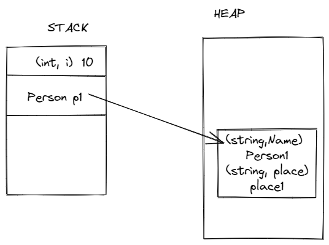

# Class, Struct & Record

## Value vs Reference Types

```c#
int i = 10;

Person p1 = new Person() {
Name = "Person1",
Place = "Place1"
}
```



|                               | **Value Type**                                         | **Reference Types**                                         |
|-------------------------------|--------------------------------------------------------|-------------------------------------------------------------|
| Content                       | Contains the data within its own memory allocation     | contains a pointer to a memory location that holds the data |
| Allocation                    | Allocated on the stack or inline in containing types   | Allocated on the heap                                       |
| DeAllocation                  | DeAllocated after stack unwinds                        | Garbage collected when they are not referenced              |
| Boxing/Unboxing               | Boxing/Unboxing to reference types affects performance | No boxing/unboxing required                                 |
| Assignments                   | Copy entire value                                      | Copy the reference                                          |
| Passing arguments to function | By value - implicitly Copied                           | By Reference                                                |
| Example                       | int, double, struct, enum etc.                         | class, interface, string etc.                               |

## When to use structs?

Do not use structs unless all the below conditions are true

- It logically represents a single value, similar to primitive types (`int`, `double`, etc.).
- It has an instance size under 16 bytes.
- It is immutable.
- It will not have to be boxed frequently.

In all other cases, you should define your types as classes.

[Microsoft Docs Link](https://docs.microsoft.com/en-us/dotnet/standard/design-guidelines/choosing-between-class-and-struct)

## Value Objects

- Objects are only used to convey values.
- We do not care about their identities.

### Description from Domain Driven Design(Eric Evans)

An object that represents a descriptive aspect of the domain with no conceptual identity is called a VALUE OBJECT
```text
When a child is drawing, he cares about the color of the marker he chooses, and he may care about the sharpness of the tip.
But if there are two markers of the same color and shape, he probably won’t care which one he uses.
If a marker is lost and replaced by another of the same color from a new pack, he can resume his work unconcerned about the switch.
```

Eg:
- Currency
- Range
- PostCode
- Age
- Phone Number
- Percentage

### Characteristics

- Value Equality
- Immutability
- Self Validation

## [Records](https://docs.microsoft.com/en-us/dotnet/csharp/language-reference/builtin-types/record)

Consider using a record,
- Data model that depends on [value equality](https://docs.microsoft.com/en-us/dotnet/csharp/programming-guide/statements-expressions-operators/equality-comparisons#value-equality)
- Type for which objects are immutable

## Features

- Concise syntax with positional syntax
- Built-in behavior
  - Value equality
  - Concise syntax for non destructive mutation
  - Formatting for display


